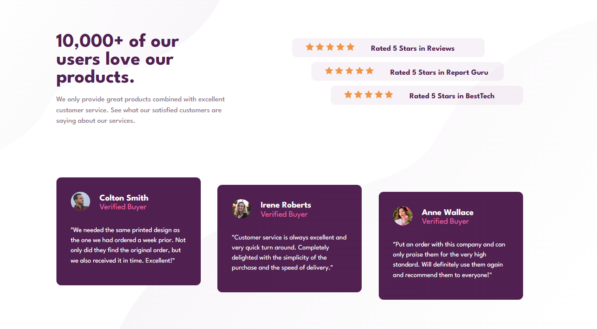
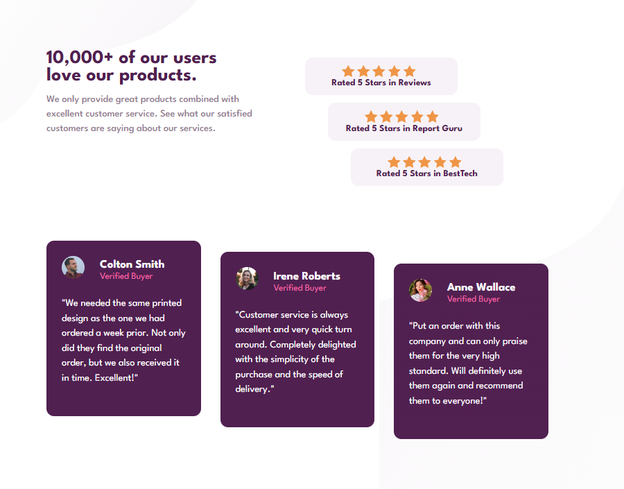
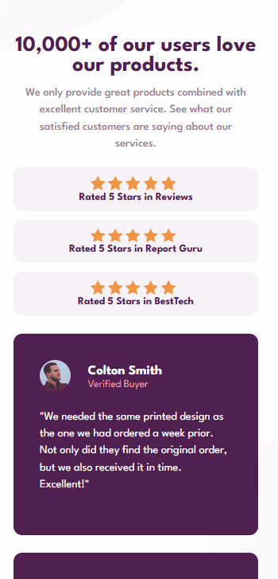

# Frontend Mentor - Solução Responsiva para Seção de Prova Social com HTML e CSS

Esta é a minha solução para o desafio [Social proof section challenge on Frontend Mentor](https://www.frontendmentor.io/challenges/social-proof-section-6e0qTv_bA) do Frontend Mentor. Os desafios do Frontend Mentor ajudam a aprimorar habilidades de codificação através da criação de projetos realistas e focados em boas práticas de desenvolvimento.

## 🗂️ Índice

- [Visão Geral](#visão-geral)
  - [Capturas de Tela](#capturas-de-tela)
  - [Links](#links)
- [Meu Processo](#meu-processo)
  - [Construído com](#construído-com)
  - [O que Aprendi](#o-que-aprendi)
  - [Desenvolvimento Contínuo](#desenvolvimento-contínuo)
  - [Desafios que Encontrei](#desafios-que-enfrentei)
- [Autor](#autor)
- [Contato](#contato)

---

## Visão Geral 

### Capturas de Tela
#### Layout para Web/desktop:

  

#### Layout para tablet:

  

#### Layout para celulares:

  

### Links

- URL do site publicado: [Clique aqui]()

---

## Meu Processo 

### Construído com

- HTML5 semântico
- CSS3 com propriedades personalizadas (CSS Variables)
- Flexbox e CSS Grid para layout responsivo
- Fluxo de trabalho Desktop-first
- Controle de versão com Git

### O que Aprendi

- Neste projeto, aprofundei minhas habilidades em HTML e CSS e ampliei meus conhecimentos ao explorar novas propriedades e técnicas, como a aplicação de sobreposições de elementos de forma responsiva em diferentes tamanhos de tela.

### Desenvolvimento Contínuo

- Estou dedicado a seguir aprimorando minhas habilidades em HTML, CSS, Git e GitHub, acreditando que a prática constante é fundamental para o crescimento. Além de aplicar o que já aprendi, cada novo desafio tem sido uma oportunidade de expandir ainda mais meus conhecimentos. Meu objetivo é manter esse ritmo de evolução contínua.

---
### Desafios que Enfrentei

- Enfrentei alguma dificuldade ao posicionar as imagens de fundo de forma responsiva para diferentes tamanhos de tela, mas consegui superar esse desafio e concluir o projeto com sucesso.

## Autor

- GitHub - [Guilherme-dDiniz](https://github.com/Guilherme-dDiniz)
- Frontend Mentor - [@Guilherme-dDiniz](https://www.frontendmentor.io/profile/Guilherme-dDiniz)